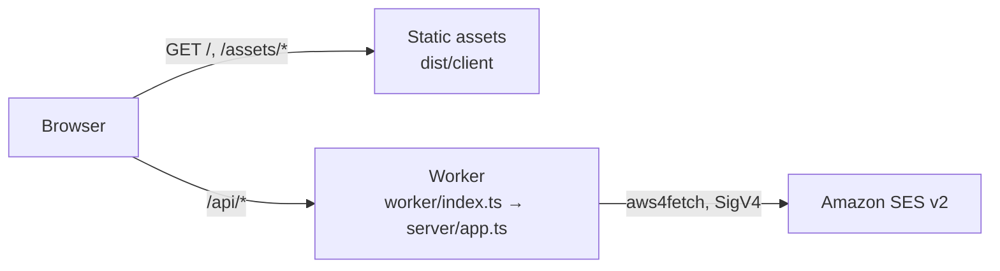

# Deployment

How the studio is deployed to Cloudflare, where it runs today, and what has to happen before it runs in a production account. Companion to `docs/PLAN.md` (the overall Cloudflare build plan) and `docs/SENDING.md` (test sends).

## Where it runs today

| Item               | Value                                                                                                                                                         |
| ------------------ | ------------------------------------------------------------------------------------------------------------------------------------------------------------- |
| URL                | https://email-template-studio.jerichodelrosario35.workers.dev                                                                                                 |
| Cloudflare account | **The developer's personal account** (Jericho del Rosario, Gmail login), account id `0f95923f7c5505d2e3261d3a788d68e0`, Workers Free plan                     |
| Worker name        | `email-template-studio`                                                                                                                                       |
| First deployed     | 2026-09-09, by hand from a laptop with `npm run deploy`, version `d131ab86`                                                                                   |
| Authentication     | **None.** Anyone with the URL can open the editor. There is nothing to protect yet: no stored data, no secrets, and sending is disabled                       |
| Sending            | Disabled (`STUDIO_SEND_ENABLED=false`). The Worker **can** send now (ADR-16), but this account must never hold AWS credentials. See "Turning live sending on" |
| Data               | None. Templates ship in the bundle; drafts live in the visitor's browser session                                                                              |

> **This is a temporary home.** The personal account was used so that the deployment pipeline could be built and verified without waiting for a company account. It must not receive AWS credentials, customer data or a custom domain. See "Moving to the production account" below; do it **before** phase 2 of `docs/PLAN.md` (D1 persistence), while there is still nothing to migrate.

## What gets deployed

One Cloudflare Worker with two parts (ADR-15 in `docs/DECISIONS.md`):

- **Static assets**: the Vite build of the studio (`dist/client`). Served by Cloudflare's asset layer, not billed as Worker requests. Unknown paths return `index.html` (single-page-app fallback).
- **The API**: `worker/index.ts` wraps the same Hono app the local Node send server uses (`server/app.ts`). Only `/api/*` reaches it (`run_worker_first` in `wrangler.jsonc`).



`npm run build` runs `wrangler types` (generates `worker-configuration.d.ts`, git-ignored), type-checks all four TypeScript projects, then `vite build` with the Cloudflare plugin, which writes `dist/client`, `dist/email_template_studio/index.js` and a resolved `wrangler.json` next to it. `wrangler deploy` reads that resolved config through `.wrangler/deploy/config.json`.

## Day-to-day commands

| Task                                  | Command                                      | Notes                                                                                |
| ------------------------------------- | -------------------------------------------- | ------------------------------------------------------------------------------------ |
| Check which account you are on        | `npx wrangler whoami`                        | Do this before every manual deploy until the production account exists               |
| Log in / switch account               | `npx wrangler login` / `npx wrangler logout` | Opens a browser; the token is stored under `~/.config/.wrangler`                     |
| Deploy                                | `npm run deploy`                             | Build then deploy; prints the URL and version id                                     |
| Roll back                             | `npx wrangler rollback`                      | Interactive; picks a previous version                                                |
| List versions                         | `npx wrangler versions list`                 |                                                                                      |
| Live logs                             | `npx wrangler tail`                          | Observability is enabled in `wrangler.jsonc`; logs also appear in the dashboard      |
| Run locally in the Cloudflare runtime | `npm run dev`                                | workerd next to Vite; variables from `.dev.vars` (see `.dev.vars.example`)           |
| Run locally with real SES sending     | `npm run dev` with keys in `.dev.vars`       | Same code path as production. `npm run dev:node` + `npm run server` is the Node path |
| Regenerate binding types              | `npm run cf:types`                           | After every change to `wrangler.jsonc`; `build` and `typecheck` do it anyway         |

## Environments

| Name                    | Where it is defined             | Purpose                                                                                   |
| ----------------------- | ------------------------------- | ----------------------------------------------------------------------------------------- |
| local                   | `.dev.vars` (git-ignored)       | `npm run dev` and `npm run preview`; sending disabled or dry-run                          |
| `e2e`                   | `wrangler.jsonc` → `env.e2e`    | Playwright only: dry-run sending with fake addresses; never deployed                      |
| top level               | `wrangler.jsonc` top-level keys | What `npm run deploy` deploys today (personal account)                                    |
| `staging`, `production` | to be added                     | Wrangler environments with their own D1, secrets and Access policy (PLAN.md phase 1 to 3) |

Rule: `vars` in `wrangler.jsonc` are for non-secret settings and are committed. Secrets go through `wrangler secret put` (or `.dev.vars` locally) and never into the file.

## Turning live sending on

The Worker can reach Amazon SES (ADR-16). Whether it _does_ is one variable plus two secrets, per environment.

> **Read this first.** The deployed studio has **no authentication** (TECH_DEBT #19). A live SES key on a public Worker means anyone with the URL can trigger a send. Three guards contain the damage: sends go only to `SES_ALLOWED_RECIPIENTS`, every subject is prefixed `[TEST]`, and the rate limit is 5 per minute. That is acceptable for a handful of internal addresses on a URL nobody has published. It is **not** acceptable once the allow-list contains a client. Put Cloudflare Access in front first (`docs/PLAN.md` phase 1), which is step 5 of the handover in `docs/HANDOVER.md`.

**1. Make the IAM user.** One user, no console access, one inline policy. The policy is the real backstop: our own code checks the allow-list, but the policy is what stops a mistake or a stolen key from mailing the world.

```json
{
  "Version": "2012-10-17",
  "Statement": [
    {
      "Sid": "SendOnlyAsTheStudioIdentityToKnownPeople",
      "Effect": "Allow",
      "Action": "ses:SendEmail",
      "Resource": "arn:aws:ses:us-east-1:<account-id>:identity/swarm.camp",
      "Condition": {
        "StringEquals": { "ses:FromAddress": "studio@swarm.camp" },
        "ForAllValues:StringEquals": {
          "ses:Recipients": ["you@swarm.camp", "teammate@swarm.camp"]
        }
      }
    },
    {
      "Sid": "ReadOnlyPreflight",
      "Effect": "Allow",
      "Action": ["ses:GetAccount", "ses:GetEmailIdentity"],
      "Resource": "*"
    }
  ]
}
```

Replace the region, account id, identity and addresses. `ses:Recipients` must list every address in `SES_ALLOWED_RECIPIENTS`; when you add one, change both. If the company uses a configuration set, add `"ses:FeedbackAddress"` or a `ses:ConfigurationSetName` condition to match its policy.

**2. Set the non-secret variables** in `wrangler.jsonc` for that environment:

```jsonc
"vars": {
  "STUDIO_SEND_ENABLED": "true",
  "STUDIO_SEND_DRY_RUN": "false",
  "AWS_REGION": "us-east-1",
  "SES_FROM_ADDRESS": "studio@swarm.camp",
  "SES_ALLOWED_RECIPIENTS": "you@swarm.camp,teammate@swarm.camp",
  "SES_CONFIGURATION_SET": "studio-events"
}
```

**3. Put the key in as secrets**, never in the file:

```bash
npx wrangler secret put AWS_ACCESS_KEY_ID
npx wrangler secret put AWS_SECRET_ACCESS_KEY
# only for temporary STS credentials, which expire and will break the Worker:
# npx wrangler secret put AWS_SESSION_TOKEN
```

**4. Deploy and check the preflight**, which asks SES directly and needs no send:

```bash
npm run deploy
curl -s https://<hostname>/api/send-test/status
```

Expect `"mode":"live"` and a `preflight.ok` of `true`. If `identityVerified` is false the sender is not verified in that region; if `sandbox` is true you can still only reach verified addresses.

**Rehearsal.** Setting `STUDIO_SEND_DRY_RUN=true` exercises the whole path, returns `dry-run-N` message ids and needs no credentials at all. Deploy that way first: it proves the config plumbing without any AWS risk.

**Rotation.** Long-lived IAM keys should be rotated on a schedule. `wrangler secret put` with the same name overwrites in place, and the next request picks it up. There is no downtime and no code change.

## Continuous integration

`.github/workflows/ci.yml` runs on every push and pull request: typecheck, lint, unit tests, formatting, production build and the Playwright suite against the Cloudflare runtime.

The `deploy` job runs on pushes to `main` only when the `CLOUDFLARE_API_TOKEN` repository secret exists; otherwise it prints a notice and is skipped. To enable it:

1. In the Cloudflare dashboard, create an API token from the "Edit Cloudflare Workers" template, scoped to the one account.
2. `gh secret set CLOUDFLARE_API_TOKEN --repo Jericho0912/email-template-studio` (paste the token when prompted).
3. The `CLOUDFLARE_ACCOUNT_ID` repository variable is already set to the personal account; change it when the account changes.

Until then, deploys are manual with `npm run deploy`.

## Moving to the production account

**`docs/HANDOVER.md` is the runbook**: the company Cloudflare account, the company GitHub organisation, Access, staging and production environments, and retiring the personal deployment, step by step with a check after each one.

The short version, in order: transfer the GitHub repository, point wrangler at the company Cloudflare account and pin `account_id`, add `staging` and `production` environments with custom-domain routes, deploy staging in dry run, put Cloudflare Access in front, only then add the SES key and switch production to live, and finally delete the personal Worker.

Do it before D1 lands (PLAN.md phase 2), while there is nothing to migrate. If the move happens after: export with `npx wrangler d1 export <db> --output backup.sql` on the old account, create the database on the new one, apply migrations, and import the backup. Plan for a short freeze of edits during the switch.

## Post-deploy checks

Run after every deploy (CI will automate these later):

```bash
U=https://email-template-studio.jerichodelrosario35.workers.dev   # or the production hostname
curl -s -o /dev/null -w "%{http_code}\n" $U/                        # 200
curl -s -o /dev/null -w "%{http_code}\n" $U/some/deep/path          # 200 (SPA fallback)
curl -s $U/api/send-test/status                                     # {"enabled":false,...} until phase 1
curl -s -o /dev/null -w "%{http_code}\n" -X POST \
  -H "origin: https://attacker.example" -H "content-type: application/json" \
  -d '{}' $U/api/send-test                                          # 403 (cross-site refused)
```

Then open the URL in a browser: the welcome template must render in the preview frame and the header must say "Preview worker ready".

## Costs

Workers Free: 100 000 requests per day, static assets unlimited, no charge today. Workers Paid (USD 5 per month) becomes necessary for Queues (PLAN.md phase 4) and is recommended once teammates use the tool daily.
