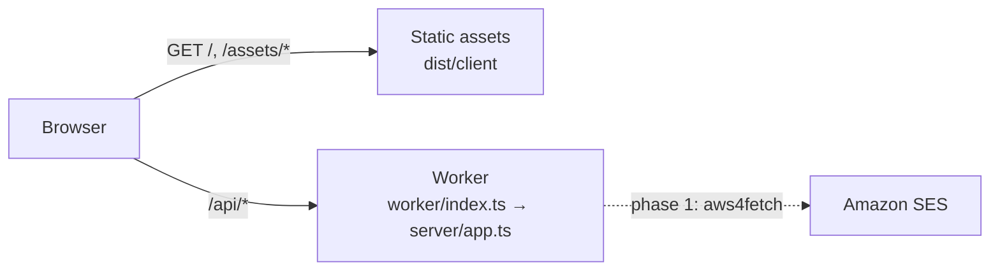

# Deployment

How the studio is deployed to Cloudflare, where it runs today, and what has to happen before it runs in a production account. Companion to `docs/PLAN.md` (the overall Cloudflare build plan) and `docs/SENDING.md` (test sends).

## Where it runs today

| Item               | Value                                                                                                                                           |
| ------------------ | ----------------------------------------------------------------------------------------------------------------------------------------------- |
| URL                | https://email-template-studio.jerichodelrosario35.workers.dev                                                                                   |
| Cloudflare account | **The developer's personal account** (Jericho del Rosario, Gmail login), account id `0f95923f7c5505d2e3261d3a788d68e0`, Workers Free plan       |
| Worker name        | `email-template-studio`                                                                                                                         |
| First deployed     | 2026-09-09, by hand from a laptop with `npm run deploy`, version `d131ab86`                                                                     |
| Authentication     | **None.** Anyone with the URL can open the editor. There is nothing to protect yet: no stored data, no secrets, and sending is disabled         |
| Sending            | Disabled (`STUDIO_SEND_ENABLED=false`). The Worker has no Amazon SES client yet; the status endpoint says so and the send dialog stays disabled |
| Data               | None. Templates ship in the bundle; drafts live in the visitor's browser session                                                                |

> **This is a temporary home.** The personal account was used so that the deployment pipeline could be built and verified without waiting for a company account. It must not receive AWS credentials, customer data or a custom domain. See "Moving to the production account" below; do it **before** phase 2 of `docs/PLAN.md` (D1 persistence), while there is still nothing to migrate.

## What gets deployed

One Cloudflare Worker with two parts (ADR-15 in `docs/DECISIONS.md`):

- **Static assets**: the Vite build of the studio (`dist/client`). Served by Cloudflare's asset layer, not billed as Worker requests. Unknown paths return `index.html` (single-page-app fallback).
- **The API**: `worker/index.ts` wraps the same Hono app the local Node send server uses (`server/app.ts`). Only `/api/*` reaches it (`run_worker_first` in `wrangler.jsonc`).



`npm run build` runs `wrangler types` (generates `worker-configuration.d.ts`, git-ignored), type-checks all four TypeScript projects, then `vite build` with the Cloudflare plugin, which writes `dist/client`, `dist/email_template_studio/index.js` and a resolved `wrangler.json` next to it. `wrangler deploy` reads that resolved config through `.wrangler/deploy/config.json`.

## Day-to-day commands

| Task                                  | Command                                      | Notes                                                                           |
| ------------------------------------- | -------------------------------------------- | ------------------------------------------------------------------------------- |
| Check which account you are on        | `npx wrangler whoami`                        | Do this before every manual deploy until the production account exists          |
| Log in / switch account               | `npx wrangler login` / `npx wrangler logout` | Opens a browser; the token is stored under `~/.config/.wrangler`                |
| Deploy                                | `npm run deploy`                             | Build then deploy; prints the URL and version id                                |
| Roll back                             | `npx wrangler rollback`                      | Interactive; picks a previous version                                           |
| List versions                         | `npx wrangler versions list`                 |                                                                                 |
| Live logs                             | `npx wrangler tail`                          | Observability is enabled in `wrangler.jsonc`; logs also appear in the dashboard |
| Run locally in the Cloudflare runtime | `npm run dev`                                | workerd next to Vite; variables from `.dev.vars` (see `.dev.vars.example`)      |
| Run locally with real SES sending     | `npm run dev:node` + `npm run server`        | The Node path; see `docs/SENDING.md`                                            |
| Regenerate binding types              | `npm run cf:types`                           | After every change to `wrangler.jsonc`; `build` and `typecheck` do it anyway    |

## Environments

| Name                    | Where it is defined             | Purpose                                                                                   |
| ----------------------- | ------------------------------- | ----------------------------------------------------------------------------------------- |
| local                   | `.dev.vars` (git-ignored)       | `npm run dev` and `npm run preview`; sending disabled or dry-run                          |
| `e2e`                   | `wrangler.jsonc` → `env.e2e`    | Playwright only: dry-run sending with fake addresses; never deployed                      |
| top level               | `wrangler.jsonc` top-level keys | What `npm run deploy` deploys today (personal account)                                    |
| `staging`, `production` | to be added                     | Wrangler environments with their own D1, secrets and Access policy (PLAN.md phase 1 to 3) |

Rule: `vars` in `wrangler.jsonc` are for non-secret settings and are committed. Secrets go through `wrangler secret put` (or `.dev.vars` locally) and never into the file.

## Continuous integration

`.github/workflows/ci.yml` runs on every push and pull request: typecheck, lint, unit tests, formatting, production build and the Playwright suite against the Cloudflare runtime.

The `deploy` job runs on pushes to `main` only when the `CLOUDFLARE_API_TOKEN` repository secret exists; otherwise it prints a notice and is skipped. To enable it:

1. In the Cloudflare dashboard, create an API token from the "Edit Cloudflare Workers" template, scoped to the one account.
2. `gh secret set CLOUDFLARE_API_TOKEN --repo Jericho0912/email-template-studio` (paste the token when prompted).
3. The `CLOUDFLARE_ACCOUNT_ID` repository variable is already set to the personal account; change it when the account changes.

Until then, deploys are manual with `npm run deploy`.

## Moving to the production account

Do this as one sitting; it takes about an hour once the accounts exist. Nothing needs to be migrated as long as it happens before D1 (PLAN.md phase 2).

1. **Account.** Get (or create) the company's Cloudflare account. Add the developers as members with the Workers Admin role. The Free plan is enough until Queues are needed (phase 4); budget for Workers Paid then.
2. **Domain.** Put a domain or a delegated subdomain on Cloudflare (for example `studio.<company>.com`). Cloudflare Access and a stable URL both need it.
3. **Point wrangler at the new account.** `npx wrangler logout`, then `npx wrangler login` with the company login. Add `"account_id": "<new id>"` to `wrangler.jsonc` so a stale login can never deploy to the wrong account. Add a `routes` entry with `custom_domain: true` for the hostname from step 2.
4. **Deploy and verify.** `npm run deploy`, then the checks below.
5. **Access.** Create a Zero Trust Access application for the hostname with an allow policy for the company email domain. PLAN.md phase 1 then adds JWT verification in the Worker so `/api/*` cannot be reached without a session.
6. **CI.** Create the API token in the new account, update the `CLOUDFLARE_API_TOKEN` secret and the `CLOUDFLARE_ACCOUNT_ID` variable on the GitHub repository.
7. **Secrets** (phase 1 and later) are created directly in the new account with `wrangler secret put`. The personal account never receives any.
8. **Retire the personal deployment.** `npx wrangler delete --name email-template-studio` while logged in to the personal account, then `npx wrangler logout`. Update the table at the top of this file and `README.md`.

If the move happens after D1 exists: export with `npx wrangler d1 export <db> --output backup.sql` on the old account, create the database on the new one, apply migrations, and import the backup. Plan for a short freeze of edits during the switch.

## Post-deploy checks

Run after every deploy (CI will automate these later):

```bash
U=https://email-template-studio.jerichodelrosario35.workers.dev   # or the production hostname
curl -s -o /dev/null -w "%{http_code}\n" $U/                        # 200
curl -s -o /dev/null -w "%{http_code}\n" $U/some/deep/path          # 200 (SPA fallback)
curl -s $U/api/send-test/status                                     # {"enabled":false,...} until phase 1
curl -s -o /dev/null -w "%{http_code}\n" -X POST \
  -H "origin: https://attacker.example" -H "content-type: application/json" \
  -d '{}' $U/api/send-test                                          # 403 (cross-site refused)
```

Then open the URL in a browser: the welcome template must render in the preview frame and the header must say "Preview worker ready".

## Costs

Workers Free: 100 000 requests per day, static assets unlimited, no charge today. Workers Paid (USD 5 per month) becomes necessary for Queues (PLAN.md phase 4) and is recommended once teammates use the tool daily.
